#### 1. Сканування хосту

Почала зі сканування портів цільової машини (`192.168.122.104`), щоб зрозуміти, з чим маємо справу, командою `sudo nmap -A --reason 192.168.122.104`. Прапорець `-A` вмикає агресивне сканування — визначення версій сервісів, ОС, а також деякі NSE-скрипти. Скан показав один відкритий порт — **80 (http)**, Apache 2.4.18 з WordPress 4.1.31 на Ubuntu.

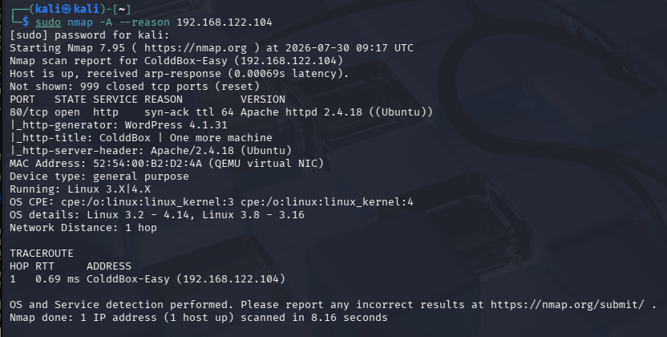

#### 2. Первинний огляд веб-сервера

Відкрила сайт у браузері — стандартна головна сторінка WordPress-теми з привітанням від автора машини, C0ldd.

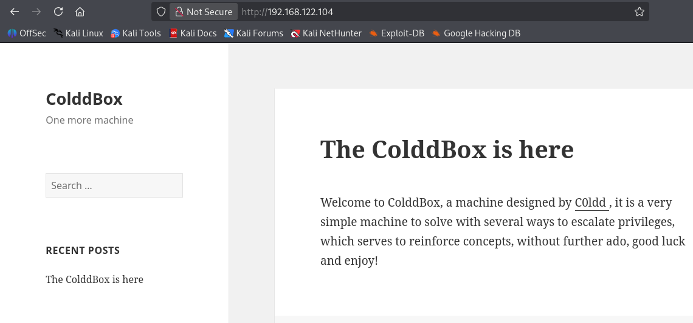

Перевірила стандартну сторінку логіну WordPress `/wp-login.php` — типова форма входу, підказала, що атака буде йти через креденшіали адміна.

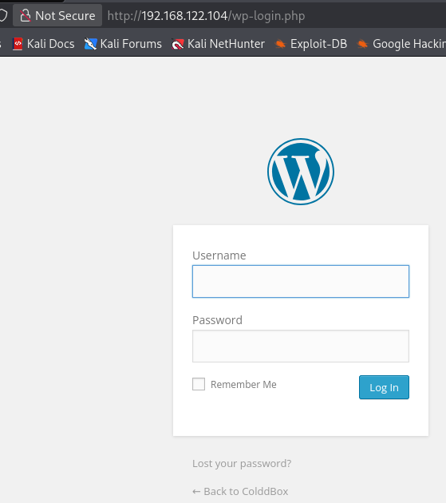

#### 3. Сканування директорій

Запустила `gobuster` для пошуку прихованих директорій та файлів командою `gobuster dir -u http://192.168.122.104/ -w /usr/share/wordlists/dirbuster/directory-list-2.3-medium.txt`. Знайшла стандартні WordPress-директорії (`wp-content`, `wp-includes`, `wp-admin`), а також нестандартну — `/hidden`.

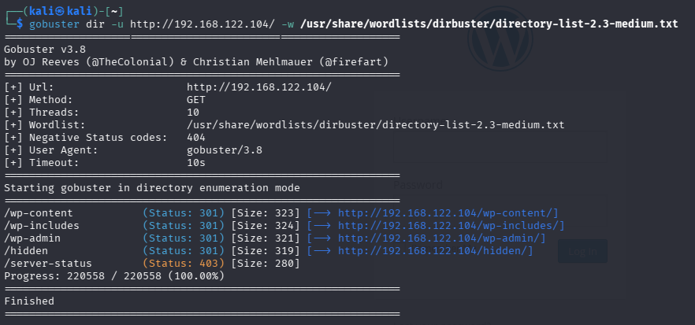

#### 4. Перевірка /hidden

Перейшла на знайдену директорію `/hidden` і побачила повідомлення від "Philip" до C0ldd про те, що той змінив пароль користувачу Hugo — підказка про існування інших користувачів у системі.

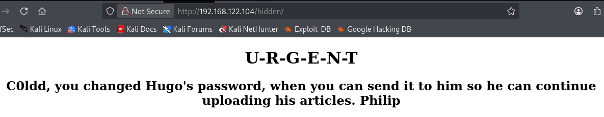

#### 5. Енумерація користувачів WordPress

Скористалась `wpscan` для пошуку користувачів WordPress командою `wpscan --url http://192.168.122.104/ -e`. Знайдено трьох користувачів: **the cold in person**, **hugo**, **c0ldd**, **philip**.

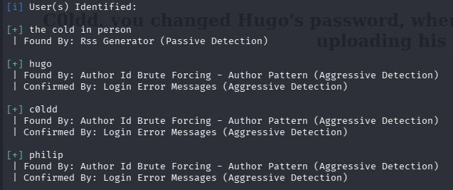

#### 6. Брутфорс пароля

Обрала користувача `c0ldd` для брутфорсу — це основний адмін-акаунт машини, найімовірніше має реальні права в системі. Виконала `wpscan --url http://192.168.122.104/ -U c0ldd -P /usr/share/wordlists/rockyou.txt` і отримала робочу пару: **c0ldd / 9876543210**.

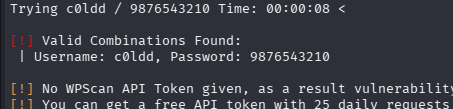

#### 7. Вхід у WordPress admin panel

Залогінилась в `/wp-admin/` знайденими кредами, отримала повний доступ до Dashboard.

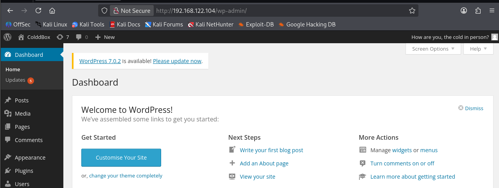

#### 8. Підготовка reverse shell через Theme Editor

Перейшла в **Appearance → Editor**, де редактор дозволяє напряму змінювати PHP-файли активної теми (Twenty Fifteen).

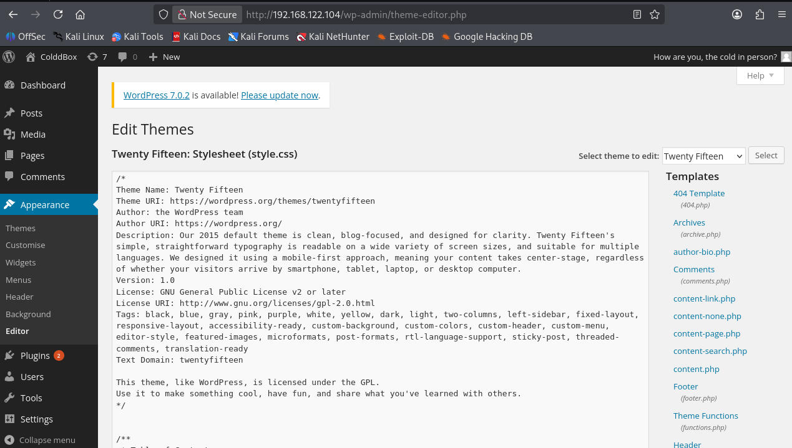

Взяла готовий скрипт reverse shell з репозиторію pentestmonkey на GitHub.

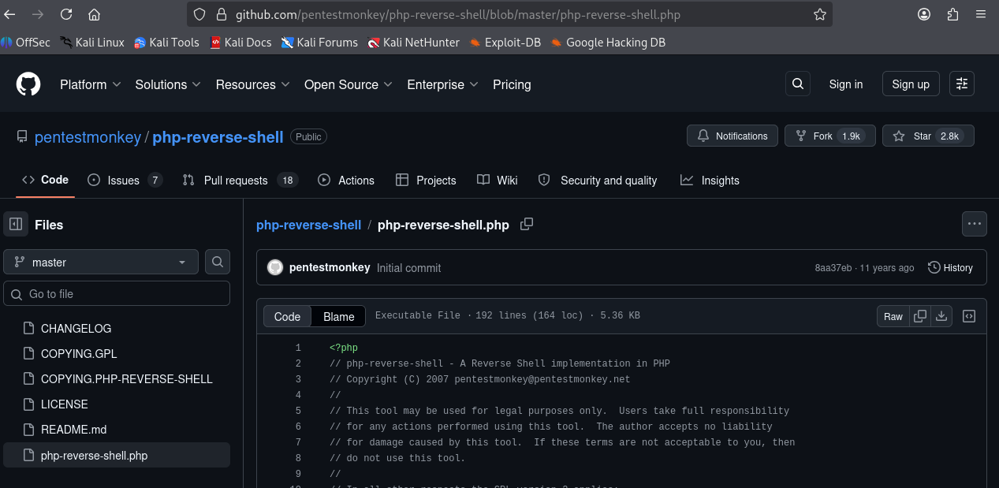

Вставила код у `footer.php`, змінивши `$ip` на IP своєї Kali-машини (`192.168.122.177`) та `$port` на `3421`, натиснула Update File.

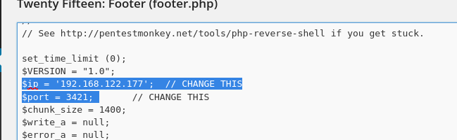

#### 9. Отримання reverse shell

Запустила listener на Kali командою `nc -lvnp 3421`. Оновила головну сторінку сайту в браузері, щоб виконався код у `footer.php` — отримала конект і робочий shell від імені `www-data`.

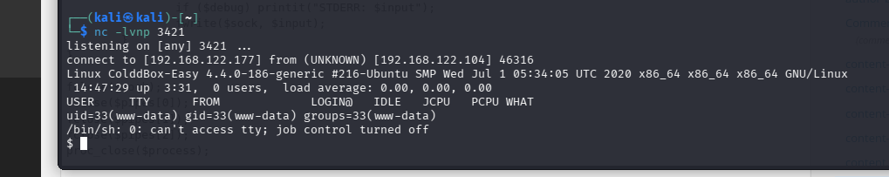

Покращила шелл до інтерактивного bash командою `python3 -c 'import pty; pty.spawn("/bin/bash")'`.

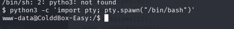

#### 10. Пошук конфігураційних файлів

Перейшла в директорію WordPress командами `cd /var/www/html` та `ls`, щоб побачити структуру сайту.

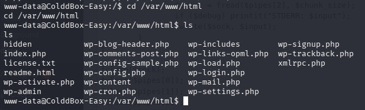

Переглянула `wp-config.php` — файл з основними налаштуваннями сайту, зокрема даними для підключення до бази даних — командою `cat wp-config.php`. Знайшла пароль бази даних: **cybersecurity**.

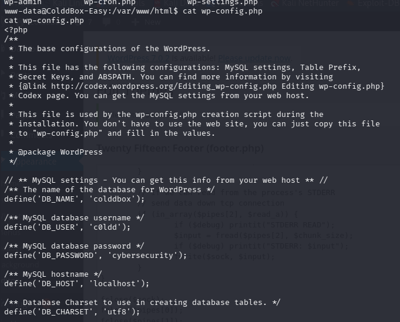

#### 11. Перехід на системного користувача

Спробувала знайдений пароль для входу під системним користувачем `c0ldd` командою `su c0ldd` — логіка проста: паролі часто повторюються між рівнями доступу в CTF. Пароль **cybersecurity** підійшов, отримала доступ до акаунту `c0ldd`.

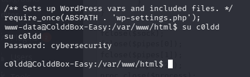

#### 12. Перший флаг (user.txt)

У домашній директорії користувача знайшла `user.txt` командами `cd /home/c0ldd` та `cat user.txt`. Вміст був закодований у Base64: `RmVsaWNpZGFkZXMsIHByaW1lciBuaXZlbCBjb25zZWd1aWRvIQ==`. Розкодувала через base64decode.org — отримала привітальне повідомлення про успішне проходження першого рівня.

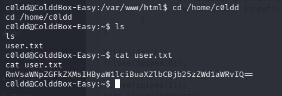

#### 13. Перевірка прав sudo

Перевірила, які команди дозволено виконувати від імені root без пароля, командою `sudo -l`. Отримала список: `/usr/bin/vim`, `/bin/chmod`, `/usr/bin/ftp` — усі три дозволені для запуску через sudo від імені root.

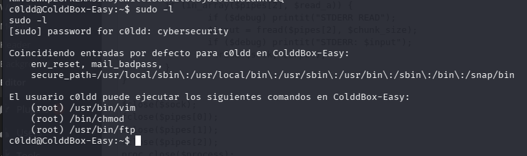

#### 14. Ескалація привілеїв через GTFOBins

Скористалась ресурсом GTFOBins (gtfobins.github.io) для пошуку технік обходу обмежень через дозволені sudo-бінарники.

**Метод 1 — chmod.** Небезпека полягає в тому, що бінарник, дозволений через sudo, не скидає підвищені привілеї — можна змінити права доступу до критичних файлів. Задала змінну `LFILE=root`, а потім виконала `sudo chmod 6777 $LFILE`.

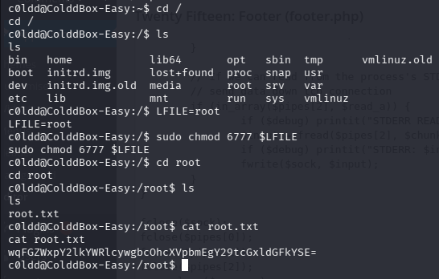

**Метод 2 — vim.** Запуск vim через sudo дозволяє виконати shell-команду напряму з редактора командою `sudo vim -c ':!/bin/sh'`. Отримала повноцінний root shell (`id` показав `uid=0(root)`).

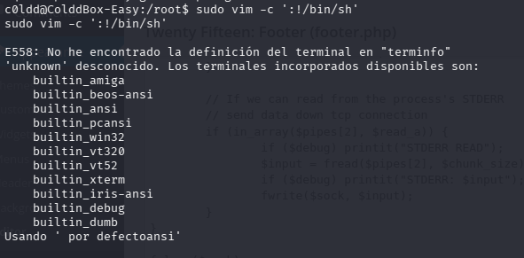
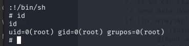

**Метод 3 — ftp.** Запустила ftp через sudo командою `sudo ftp`, а потім вийшла у shell командою `!/bin/bash`. Отримала root shell, підтверджений командою `id`.

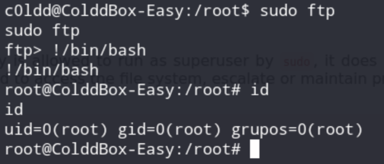
