### Сканування хосту

Почали зі сканування портів, щоб зрозуміти, з чим маємо справу: `nmap -Pn -v 192.168.122.78`. Параметр `-Pn` вимикає попередню перевірку доступності хосту через ping — деякі машинки фільтрують ICMP, і без цього прапорця nmap міг би просто пропустити ціль як "мертву". Скан показав два відкритих порти — **22 (ssh)** та **80 (http)**. Брутфорсити SSH одразу не було сенсу: без логіну і пароля це просто марна трата часу, тож пішли досліджувати веб-сервер на 80 порті — там зазвичай і залишають підказки чи вразливості, через які можна здобути креди.

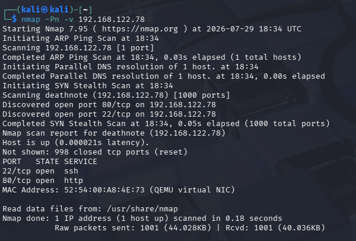

### Визначення домену

При спробі відкрити сайт напряму по IP браузер не показав нормальної сторінки — натомість підказка вела на доменне ім'я **deathnote.vuln**. Оскільки в мережі немає DNS-сервера, який знає про цей домен, прописали відповідність вручну через `/etc/hosts` — це локальний файл, який Linux перевіряє перед тим як звертатись до DNS, тож можна підмінити резолвінг будь-якого імені на потрібну IP.

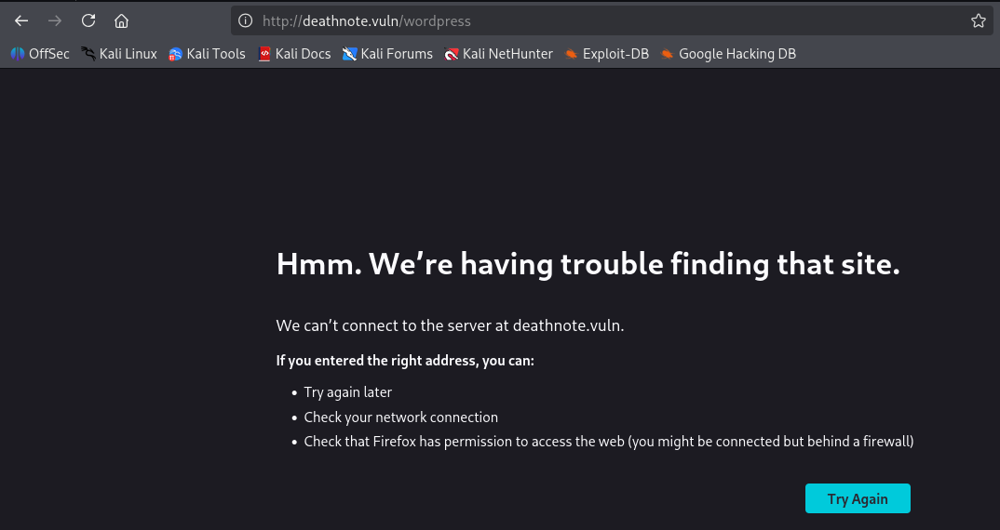
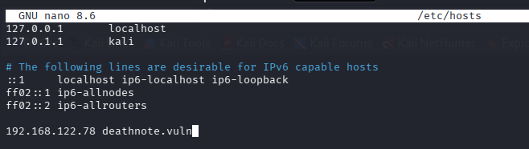

### Перший вхід на сайт

Після резолву домену відкрилась головна сторінка з темою Kira/Death Note на WordPress.

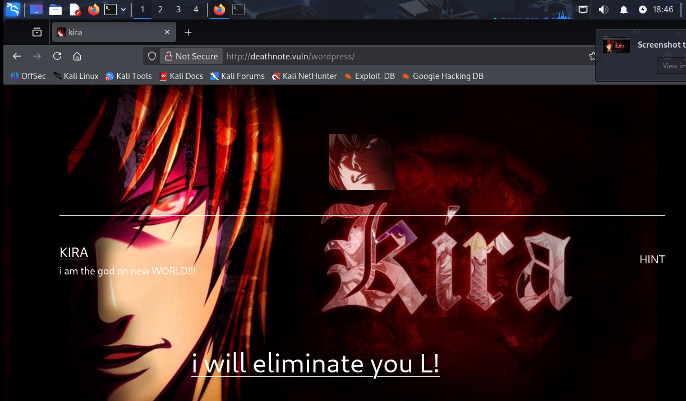

### Сканування директорій

Раз є веб-сервер на WordPress — логічно перевірити, які директорії й файли на ньому доступні, які могла забути закрити адміністратор. Для цього запустили `dirsearch -u http://deathnote.vuln/` — інструмент, який брутфорсить шляхи за словником і одразу підказує, що там є цікавого. Скан показав `/robots.txt` та шлях до `/wordpress/wp-login.php`.

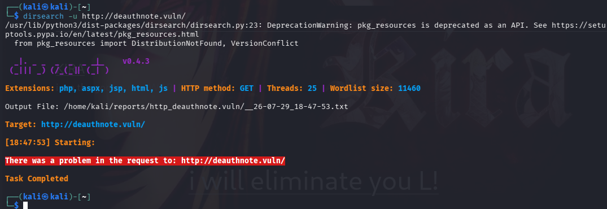
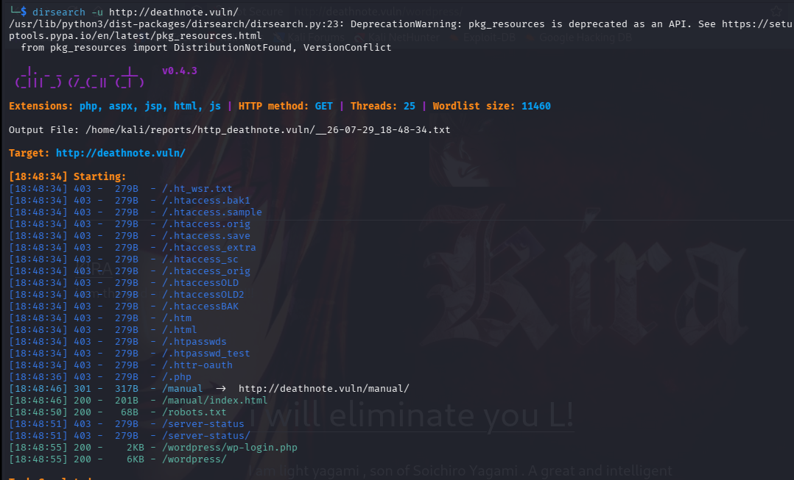

### robots.txt

Зайшли на `http://deathnote.vuln/robots.txt` — цей файл зазвичай використовують, щоб заборонити пошуковикам індексувати певні сторінки, але тут він виявився джерелом підказки: повідомлення від "сина", що додав хінт на `/important.jpg`, і прохання від імені Ryuk його видалити.

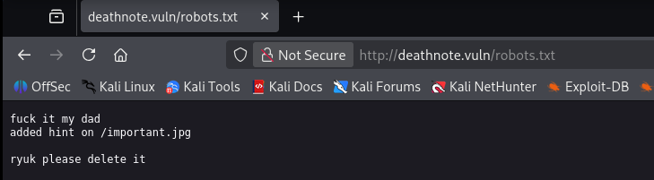

### important.jpg

Перейшли за вказаним шляхом, але сама картинка нічого не показала — тож зайшли через `curl http://deathnote.vuln/important.jpg`, щоб побачити сирий вміст файлу, а не те, як його намагається відрендерити браузер. Отримали текстове повідомлення від Соічіро Ягамі: логін лежить у `user.txt`, а пароль треба шукати самостійно десь у hint-секції сайту.

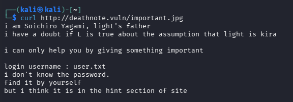

### Пошук notes.txt та user.txt

Шлях до директорії з картинками (там, де лежав `kiralogo.jpeg` та інші файли з "kira" в назві) підказав, де шукати далі — в браузері перейшли безпосередньо в `wp-content/uploads/2021/07/`, і листинг директорії був відкритий. Там знайшли `notes.txt` (схоже на список можливих паролів) та `user.txt` (схоже на список логінів) — обидва файли зберегли собі локально.

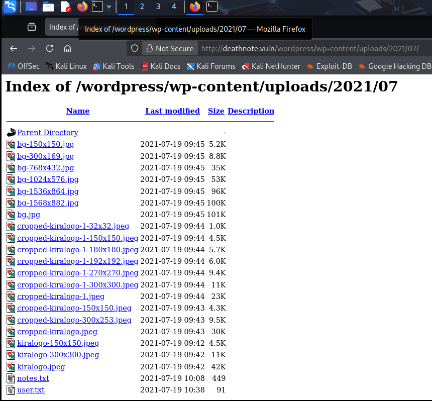

### Брутфорс SSH

Тільки тепер, коли на руках з'явились потенційні списки логінів і паролів, мало сенс атакувати SSH — брутфорсити наосліп по всьому словнику було б довго й непродуктивно, а тут атака звужена до двох конкретних невеликих файлів. Запустили `hydra -L user.txt -P notes.txt 192.168.122.78 ssh`, і отримали робочу пару: **l / death4me**.

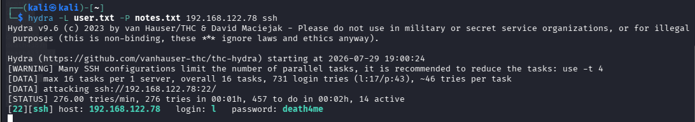

### Вхід по SSH

`ssh l@192.168.122.78` з отриманими кредами — залогінились без проблем.

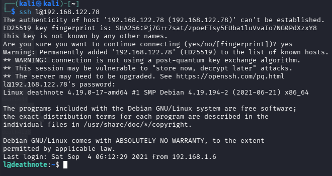

### user.txt у домашній директорії

В `ls -la` в домашній директорії лежав ще один `user.txt`. Прочитали його — текст був закодований мовою Brainfuck. Розкодували через dcode.fr і отримали повідомлення від Kira: _"i think u got the shell, but you won't be able to kill me — kira"_ — тобто це просто "флейвор"-текст, підказка що ми на правильному шляху, а не сам флаг.

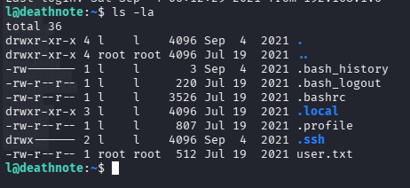

### Пошук усього, що пов'язано з "kira"

Оскільки повідомлення явно натякало на "Kira" як на наступну ціль, пошукали по всій файловій системі: `find / -iname "*kira*" 2>/dev/null`. Це вивело кілька шляхів, і серед них — цікаву директорію в `/opt`, пов'язану з "kira-case".

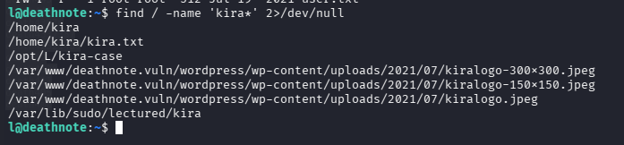
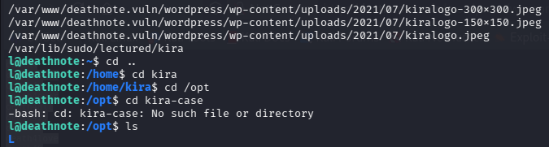

### case-file.txt

Зайшли в знайдену директорію і прочитали `case-file.txt` — там був опис розслідування смерті ФБР-агента, і головне — пряма вказівка, що щось цікаве заховано в папці **fake-notebook-rule**.

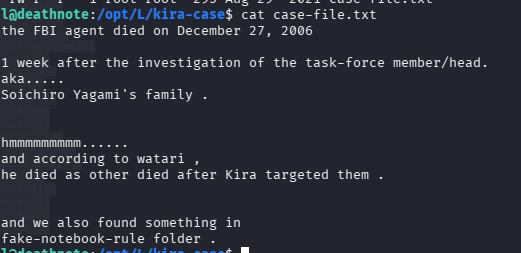

### fake-notebook-rule → case.wav

Зайшли в цю папку і подивились вміст файлу `case.wav` — попри аудіо-розширення, файл виявився текстовим hex-дампом, а не звуком. Розкодували hex у текст і отримали пароль, який співпадає з тим, що вказано в оригінальному врайтапі: **kiraisevil**.

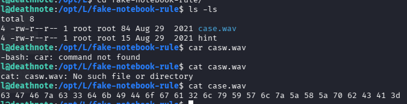

### Перехід на kira та отримання root

З отриманим паролем перейшли на користувача `su kira`, а тоді спробували той самий пароль і для `sudo -i` — логіка проста: часто на CTF-машинках один пароль "переносять" на кілька рівнів доступу, тож варто спробувати перш ніж шукати щось нове. Пароль спрацював, отримали root-доступ, зайшли в `/root` і прочитали фінальний `root.txt` з ASCII-артом.

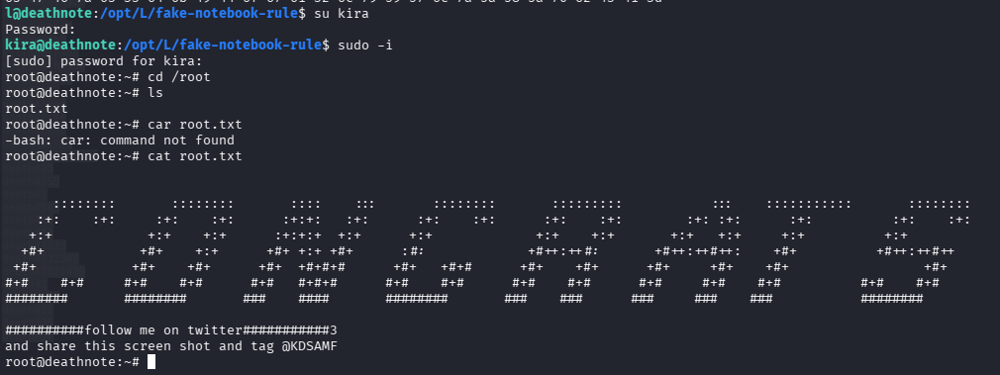
