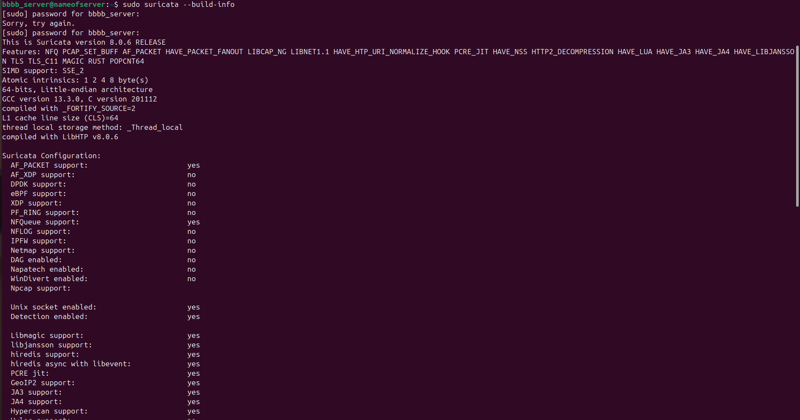
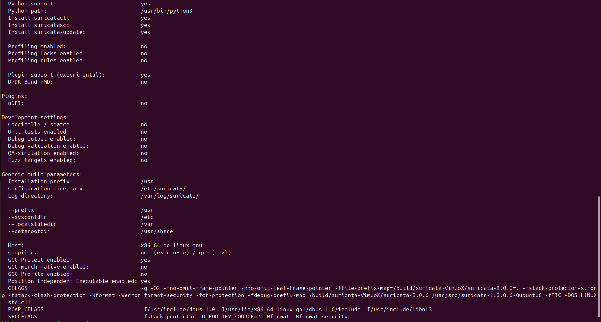
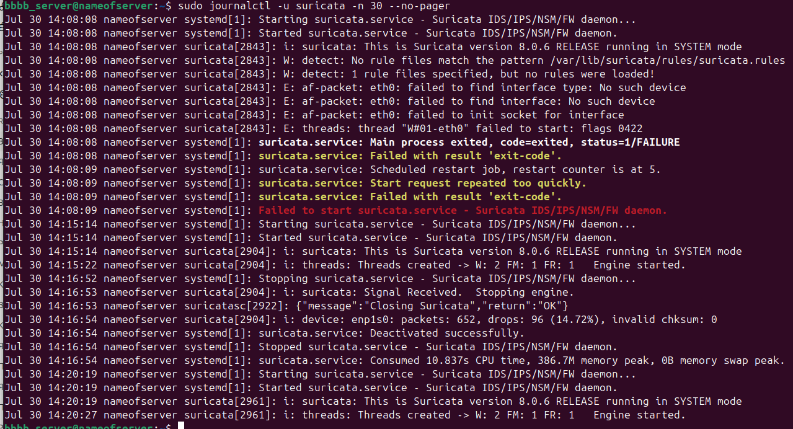
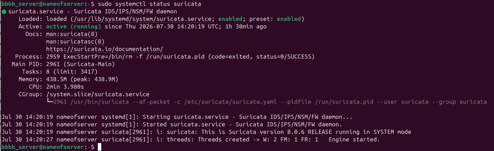
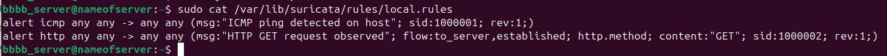
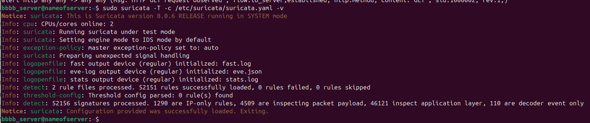
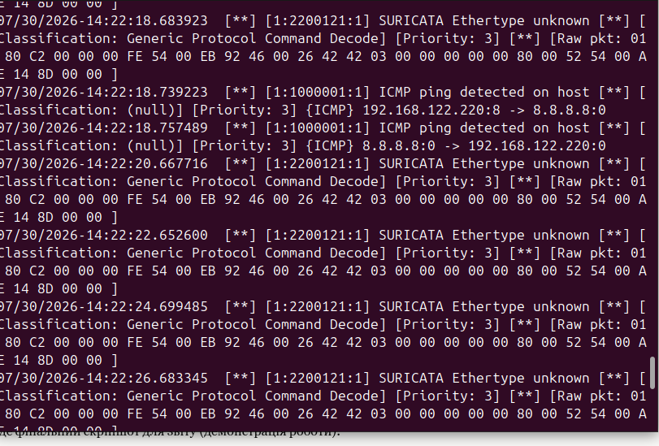
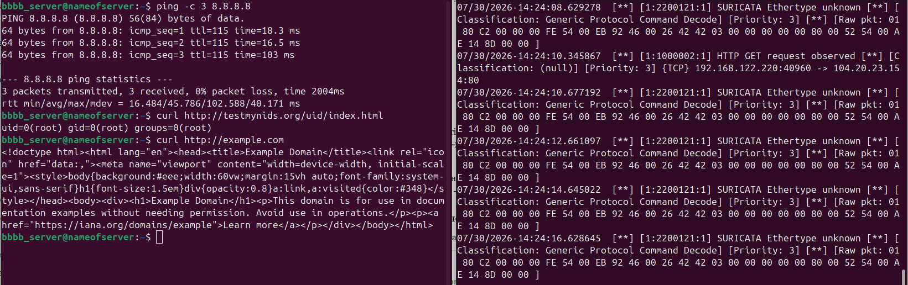

#### 1. Встановлення та запуск Suricata

Suricata встановлена з PPA-репозиторію OISF (`ppa:oisf/suricata-stable`) на Ubuntu 24.04. Перевірка версії та зібраних фіч:

При першому запуску сервіс падав з помилкою — дефолтний конфіг вказував на неіснуючий інтерфейс `eth0`, тоді як на сервері реальний інтерфейс — `enp1s0`.

Виправлено `/etc/suricata/suricata.yaml`: `HOME_NET` встановлено на `192.168.122.0/24`, інтерфейс у секції `af-packet` змінено на `enp1s0`. Також встановлені правила через `suricata-update`.

#### 2. Зупинка Suricata та додавання власних правил

Сервіс зупинявся командою `systemctl stop suricata` (підтверджено записом `Deactivated successfully` у логах вище, Скрін 5). Створено файл `/var/lib/suricata/rules/local.rules` з двома власними правилами, додано до `rule-files` у конфігурації Suricata:
alert icmp any any -> any any (msg:"ICMP ping detected on host"; sid:1000001; rev:1;)
alert http any any -> any any (msg:"HTTP GET request observed"; flow:to_server,established; http.method; content:"GET"; sid:1000002; rev:1;)
**Правило 1 (sid 1000001)** — тип `alert`, протокол `icmp`, джерело/призначення — будь-які IP і порти (`any any -> any any`). Правило спрацьовує на будь-який ICMP-пакет (наприклад, ping) і генерує повідомлення "ICMP ping detected on host".

**Правило 2 (sid 1000002)** — тип `alert`, протокол `http`. Умова `flow:to_server,established` означає, що пакет має йти від клієнта до сервера у вже встановленому TCP-з'єднанні; `http.method` + `content:"GET"` перевіряють, що це саме GET-запит. Правило генерує повідомлення "HTTP GET request observed".

#### 3. Запуск Suricata та тестування правил

Перед запуском конфігурація перевірена в тестовому режимі:

Після успішного запуску (Скрін 6 вище) правила протестовані генерацією реального трафіку:

**Висновок:** обидва кастомних правила успішно завантажені та коректно спрацьовують на відповідний трафік, що підтверджує працездатність налаштованої Suricata IDS.
