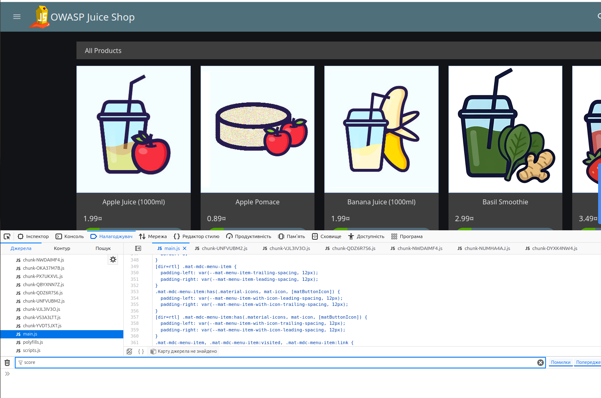
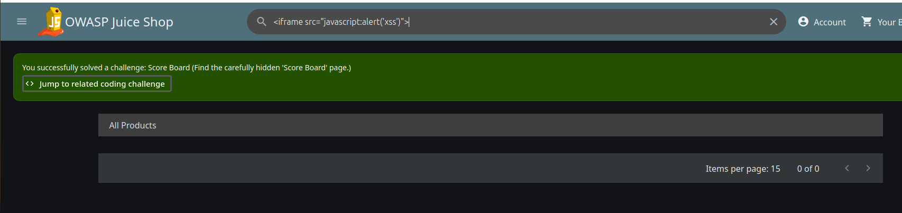
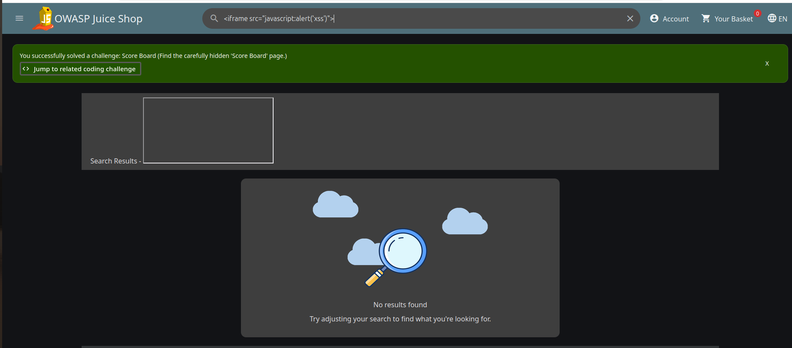
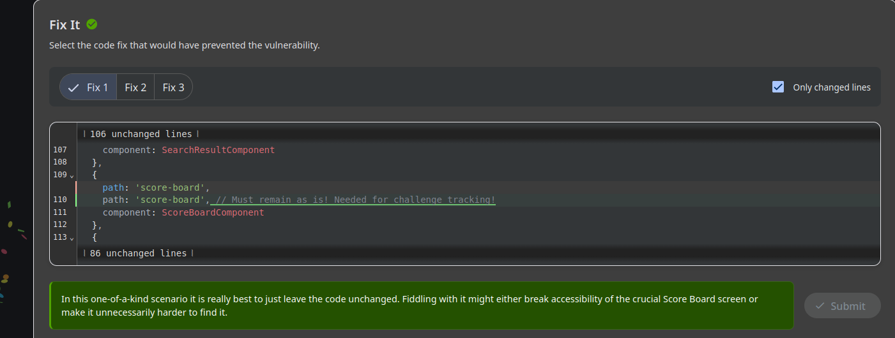
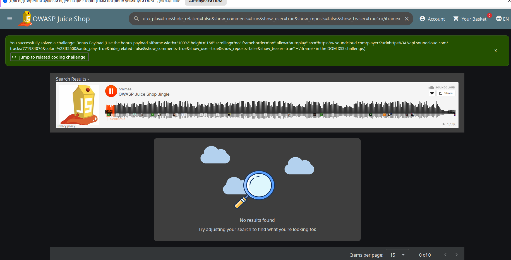
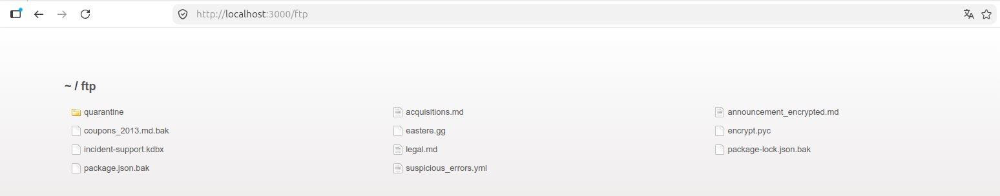
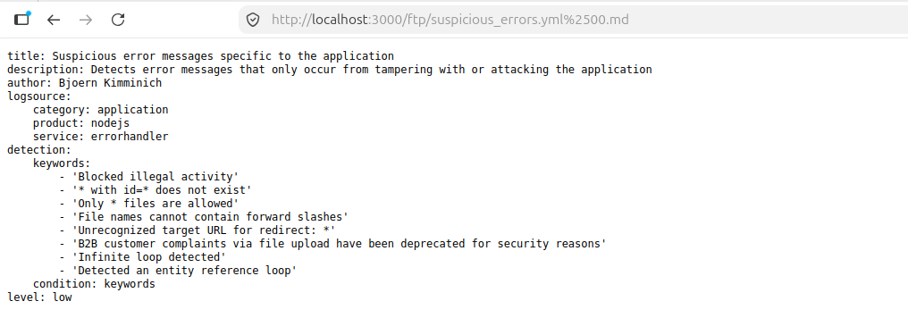
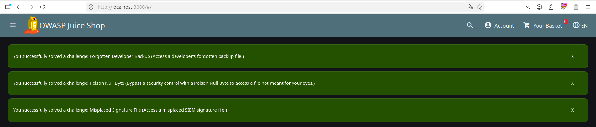
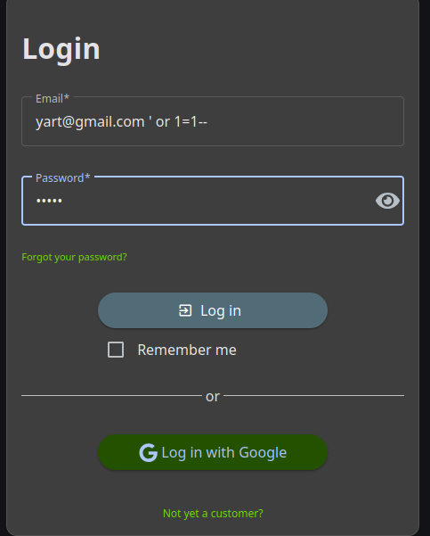
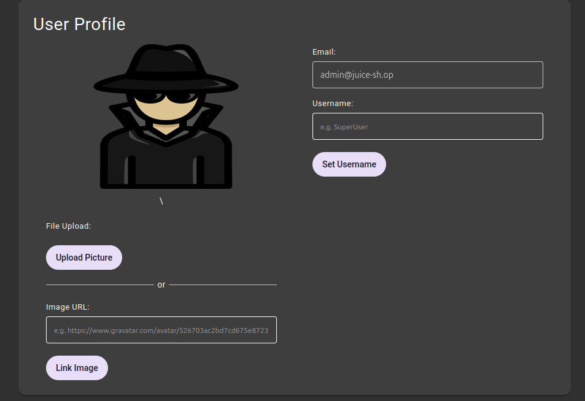

**Пошук Score Board через DevTools**

Відкриваємо DevTools (F12) → вкладка Джерела (Sources) → файл `main.js`. Через пошук (Ctrl+F) шукаємо слово "score" по коду бандла і знаходимо роут `score-board`.

**DOM XSS через рядок пошуку**

У полі пошуку вводимо пейлоад `<iframe src="javascript:alert('xss')">`. Спрацьовує XSS, і одночасно система зараховує рішення завдання Score Board (оскільки алерт підтверджує виконання скрипта на прихованій сторінці).

Пошук нічого не знаходить у видимих результатах ("No results found"), але XSS все одно спрацював — челендж зарахований.

**Coding Challenge: Score Board — Find It**

У вбудованому редакторі коду (розділ Coding Challenges) знаходимо блок маршруту:
{ path: 'score-board', component: ScoreBoardComponent }
Виділяємо рядок 110 як вразливий і тиснемо "Submit line 110 as vulnerable".

**Coding Challenge: Score Board — Fix It**

З трьох запропонованих варіантів фіксу обираємо Fix 1 — залишити код без змін, оскільки Score Board навмисно доступна лише "за замовчуванням прихованим" URL без будь-яких обмежень доступу; будь-яка спроба "захистити" її зламала б саму механіку гри. Тиснемо Submit.

**Bonus Payload у DOM XSS**

У пошук вставляємо розширений пейлоад з `<iframe>` SoundCloud-плеєра (офіційний "бонусний" пейлоад Juice Shop). Скрипт виконується, вбудовується аудіоплеєр з жинглом OWASP Juice Shop, і зараховується завдання "Bonus Payload".

**Розвідка директорії /ftp**

Переходимо на `http://localhost:3000/ftp` і бачимо список файлів на сервері: бекапи (`.bak`), документи (`.md`), файл паролів KeePass (`incident-support.kdbx`), скрипт шифрування (`encrypt.pyc`) тощо.

**Poison Null Byte (обхід фільтра розширень)**

Сервер дозволяє качати лише `.md`/`.pdf`. Обходимо обмеження, додаючи `%2500.md` після справжньої назви файлу — `package.json.bak%2500.md`. Сервер "обрізає" рядок на null byte і фактично віддає `package.json.bak`, замаскований під дозволене розширення. Файл успішно завантажується.

Той самий трюк застосовуємо до `suspicious_errors.yml%2500.md` — отримуємо вміст файлу: Sigma-подібне правило детекції підозрілих повідомлень про помилки застосунку (індикатори атак/тамперингу).

**Результат розвідки FTP**

Завдяки Poison Null Byte вдалось пройти одразу кілька завдань: "Forgotten Developer Backup" (доступ до забутого бекапу розробника), "Poison Null Byte" (сам обхід фільтра) та "Misplaced Signature File" (доступ до файлу сигнатур SIEM).

**SQL Injection в формі логіну**

На сторінці Login у поле Email вводимо `yart@gmail.com ' or 1=1--`, пароль — довільний. Класична SQLi обходить перевірку пароля через коментування залишку запиту (`--`), і умова `1=1` завжди істинна.

**Результат SQLi — вхід під адміном**

Успішний вхід відбувся під обліковим записом першого користувача в базі — `admin@juice-sh.op`. У профілі користувача бачимо цей email, підтверджуючи, що ми залогінені як адміністратор без знання його пароля.

