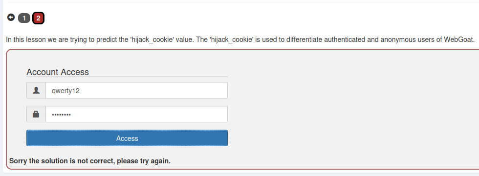
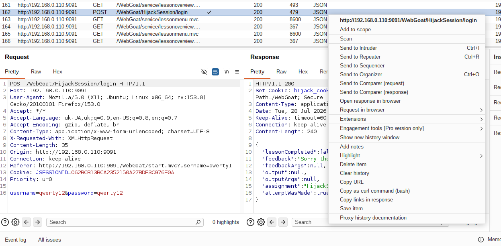
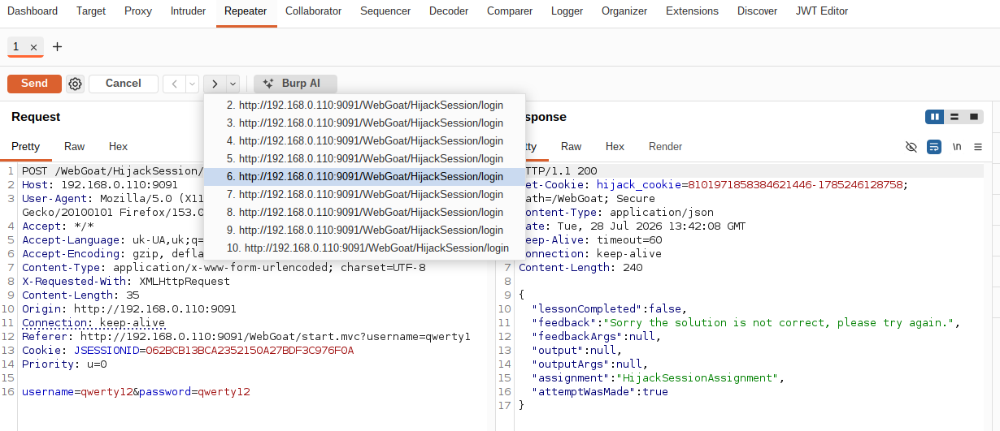
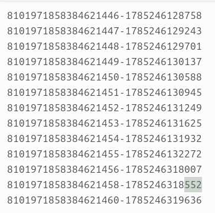
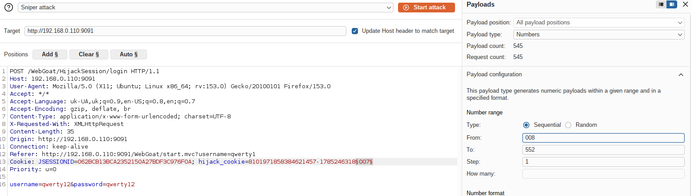
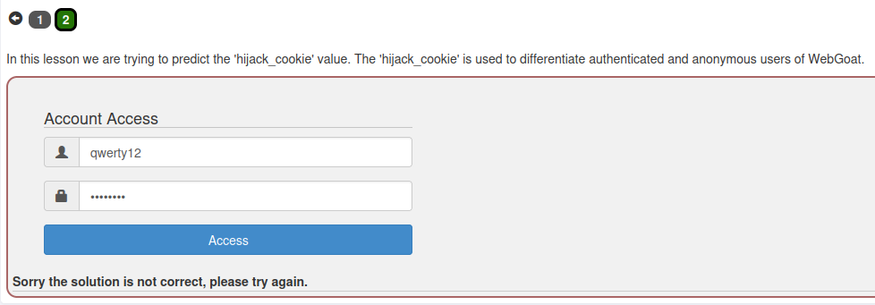

Вводимо облікові дані (`qwerty12` / пароль) на сторінці завдання та тиснемо Access. Отримуємо помилку "Sorry the solution is not correct", бо `hijack_cookie` ще не відомий.

Переходимо в Burp Suite → HTTP History, знаходимо POST-запит `/WebGoat/HijackSession/login`, який відповідає нашому логіну. У відповіді сервера в `Set-Cookie` бачимо значення `hijack_cookie` у форматі `{session_id}-{timestamp}`.

Відправляємо цей запит у Repeater та робимо ~10 повторних Send. З кожної відповіді фіксуємо нове значення `hijack_cookie`.

Дивимось на отримані значення — session_id йде послідовно, а в одному місці бачимо розрив (пропущене значення між двома сусідніми). Timestamp у цьому проміжку теж відомий частково, тож зрозуміло, що брутити треба лише останні три цифри timestamp.

Відправляємо запит із пропущеним session_id в Intruder, позначаємо останні три цифри timestamp як payload-позицію, тип — Numbers, задаємо діапазон і запускаємо Start attack.

Серед результатів атаки знаходимо відповідь з іншим значенням Length — це і є правильно вгадана сесія. Підставляємо знайдене значення `hijack_cookie`, і завдання позначається зеленим — сесію отримано, лаба вирішена.

