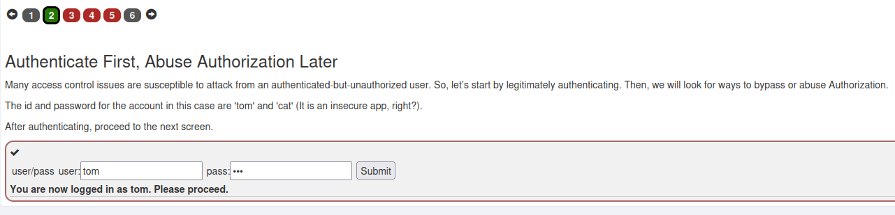
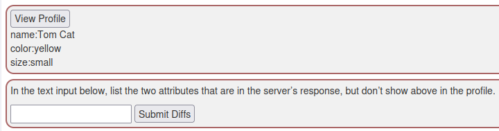
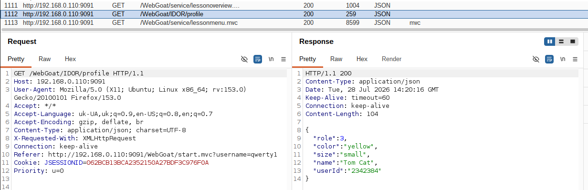
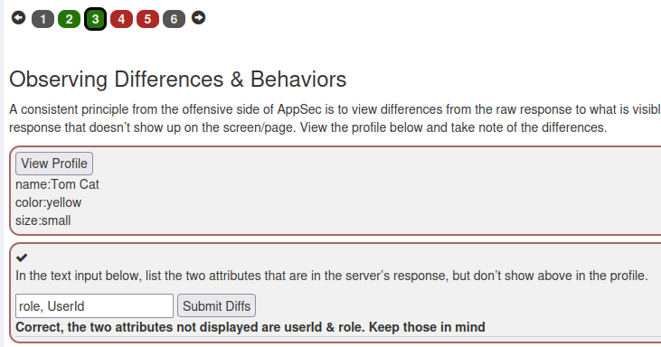
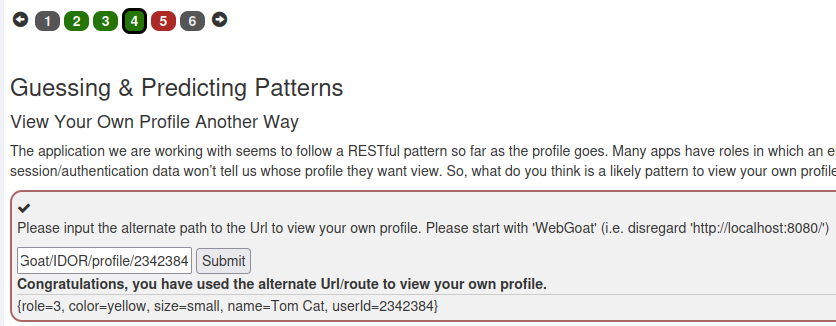
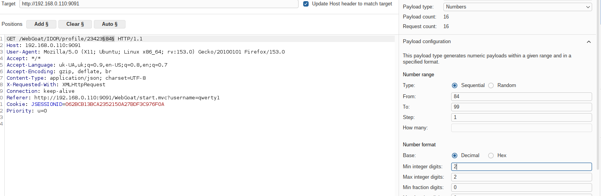
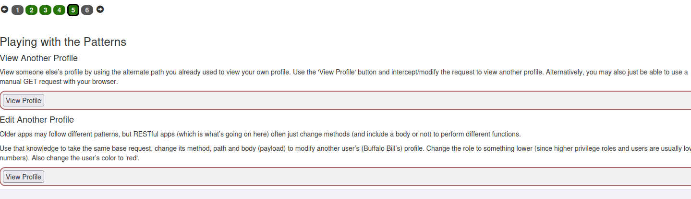
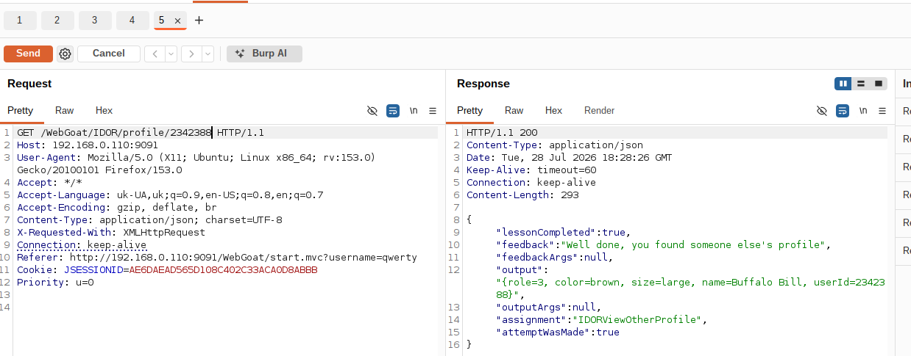
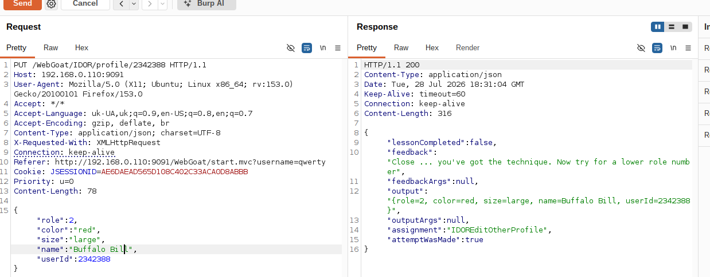
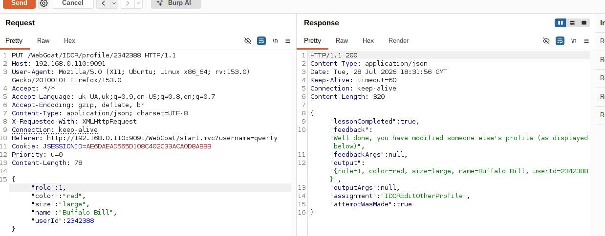

Автентифікуємось під обліковим записом `tom` / `cat` на сторінці завдання. Отримуємо повідомлення "You are now logged in as tom. Please proceed."

Тиснемо "View Profile" — бачимо власний профіль з полями name, color, size. Завдання просить знайти два атрибути, які присутні у відповіді сервера, але не відображаються на сторінці.

Переходимо в Burp Suite → HTTP History, знаходимо GET-запит `/WebGoat/IDOR/profile`. У "сирій" JSON-відповіді сервера бачимо два додаткові поля, яких немає в UI: `role` та `userId`.

Вводимо знайдені атрибути (`role`, `userId`) у форму — відповідь підтверджує правильність.

Застосунок дотримується RESTful-підходу, тож пробуємо альтернативний шлях для перегляду власного профілю за прямим посиланням на об'єкт: `/WebGoat/IDOR/profile/{userId}`. Підставляємо свій `userId=2342384` і отримуємо свій профіль — гіпотеза підтверджена.

Відправляємо запит перегляду профілю в Intruder, позначаємо `userId` як payload-позицію (числовий діапазон 84–99), запускаємо перебір, щоб знайти дійсні ID інших користувачів.

Використовуючи знайдений чужий ID, надсилаємо GET-запит `/WebGoat/IDOR/profile/2342388` — отримуємо профіль іншого користувача (Buffalo Bill, role=3, color=brown). Відповідь підтверджує: "Well done, you found someone else's profile".

Беремо той самий запит, змінюємо метод на PUT, додаємо в тіло запиту JSON з новою роллю (2) та кольором "red". Сервер приймає запит, але повертає підказку "Close ... you've got the technique. Now try for a lower role number" — роль потрібно зменшити ще.

Зменшуємо роль до 1 і повторно надсилаємо PUT-запит. Сервер підтверджує успішну зміну чужого профілю: `"lessonCompleted":true`, "Well done, you have modified someone else's profile (as displayed below)".

**Висновок:** застосунок не перевіряв, чи має автентифікований користувач право на перегляд і редагування об'єкта (профілю) за довільним ID, що дозволило як переглянути (горизонтальний обхід контролю доступу), так і відредагувати чужий профіль, підвищивши власні привілеї шляхом зниження числового значення ролі (вертикальний обхід контролю доступу).
