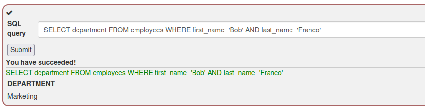
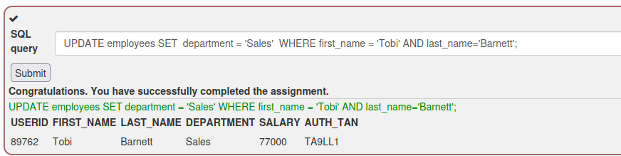
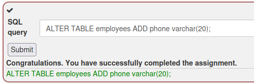
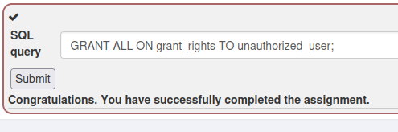
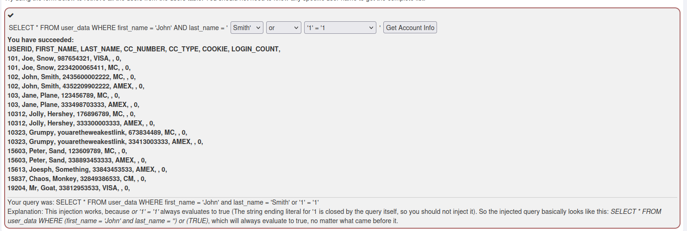
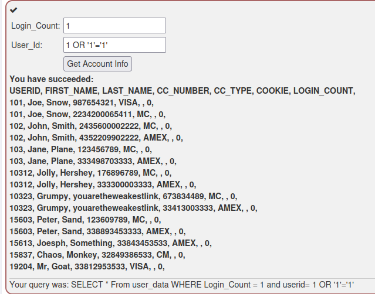
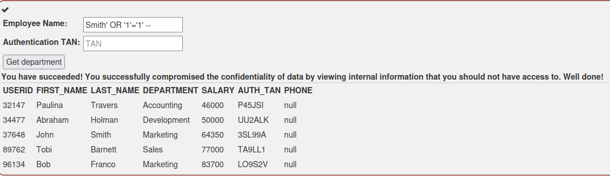
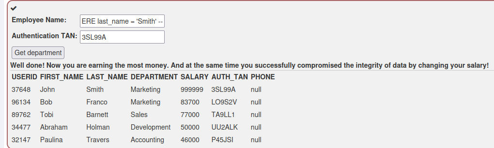
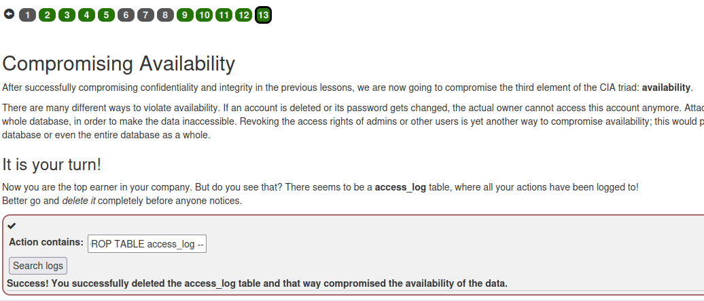

Вводимо базовий SELECT-запит для перевірки роботи DML: `SELECT department FROM employees WHERE first_name='Bob' AND last_name='Franco'`. Отримуємо департамент співробітника (Marketing) — демонструє механіку витягування даних через SELECT.

Виконуємо UPDATE-запит для зміни департаменту Tobi Barnett на 'Sales': `UPDATE employees SET department = 'Sales' WHERE first_name = 'Tobi' AND last_name='Barnett';`. Запис успішно оновлено — департамент змінено, що демонструє, як DML-команда UPDATE може порушити цілісність (integrity) даних.

Виконуємо DDL-команду `ALTER TABLE employees ADD phone varchar(20);` — додаємо нову колонку `phone` до таблиці. Це показує, що DDL (Data Definition Language) керує структурою таблиць, а не самими даними.

Виконуємо DCL-команду `GRANT ALL ON grant_rights TO unauthorized_user;` — надаємо повні права невповноваженому користувачу. Демонструє, що DCL (Data Control Language) керує правами доступу, і якщо атакуючий може ін'єктувати такі команди, він може підвищити привілеї стороннього акаунту.

Переходимо до практичної SQL-ін'єкції: у формі з випадаючими списками вибираємо умову `first_name='John' and last_name='Smith' or '1'='1'`. Оскільки `'1'='1'` завжди істинне, а лапка закриває рядковий літерал сама, WHERE-умова стає завжди істинною — це дозволяє отримати **всі** записи таблиці `user_data`, включно з номерами кредитних карток інших користувачів. Спрацьовує класична техніка `OR '1'='1'`, яка обходить перевірку конкретного імені/прізвища.

У числовому полі `User_Id` вводимо `1 OR '1'='1'` замість конкретного ID. Оскільки поле обробляється без належної валідації/параметризації, ін'єкція знову змушує WHERE-умову бути істинною для всіх рядків — отримуємо повний дамп таблиці `user_data` за конфіденційними даними (номери карток).

У полі `Employee Name` вводимо рядкову ін'єкцію: `Smith' OR '1'='1' --`. Одинарна лапка закриває початковий рядковий літерал, `OR '1'='1'` робить умову завжди істинною, а `--` коментує залишок оригінального запиту (включно з перевіркою TAN-токена). Це дозволяє обійти автентифікацію і отримати повний список співробітників з конфіденційними даними (зарплати, TAN-коди) — компрометація confidentiality.

Використовуючи знайдений раніше валідний TAN-код (`3SL99A`), в полі `Employee Name` вставляємо union/stacked-ін'єкцію, яка модифікує поточний UPDATE-запит: результат — власна зарплата (John Smith) змінена на `999999`. Це демонструє, як ін'єкція може перетворити звичайний SELECT-запит на команду модифікації даних (UPDATE), компрометуючи integrity — атакуючий підвищує собі зарплату.

В останньому кроці (компрометація availability) у поле `Action contains` вводимо ін'єкцію типу `'; DROP TABLE access_log --`, яка завершує оригінальний запит і додає stacked-запит `DROP TABLE access_log`. В результаті таблиця логів `access_log` повністю видаляється з бази даних — це приклад того, як SQL-ін'єкція може порушити доступність даних (availability), знищуючи записи або цілі таблиці.

**Висновок:** усі три складові CIA-тріади (Confidentiality, Integrity, Availability) можуть бути порушені через SQL-ін'єкцію, якщо застосунок конкатенує користувацький ввід безпосередньо в SQL-запити без параметризації (prepared statements) чи належної санітизації вхідних даних. Захист — використання параметризованих запитів (PreparedStatement), валідація вхідних даних та застосування принципу найменших привілеїв для облікових записів БД.
